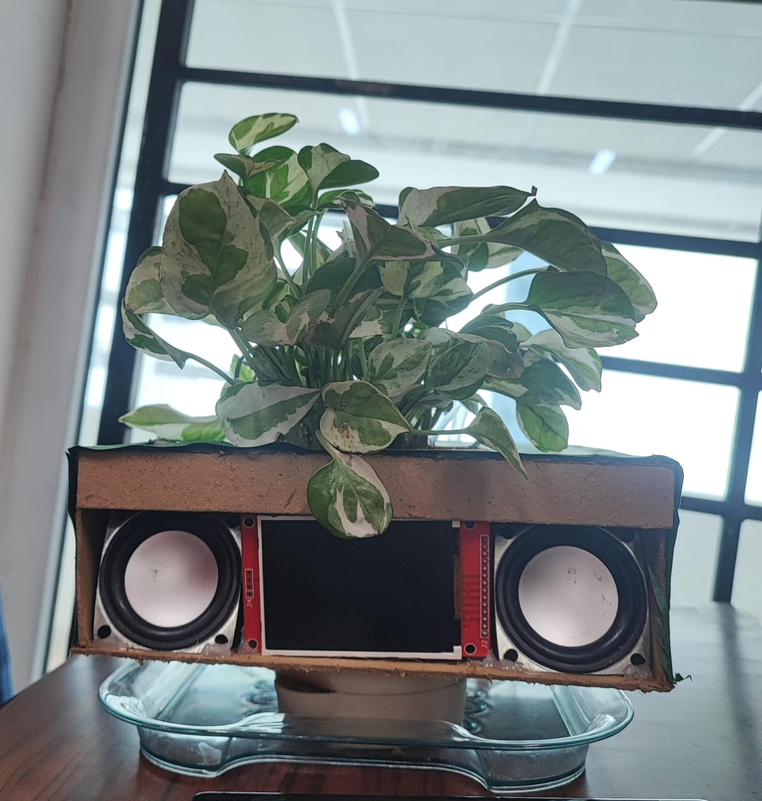
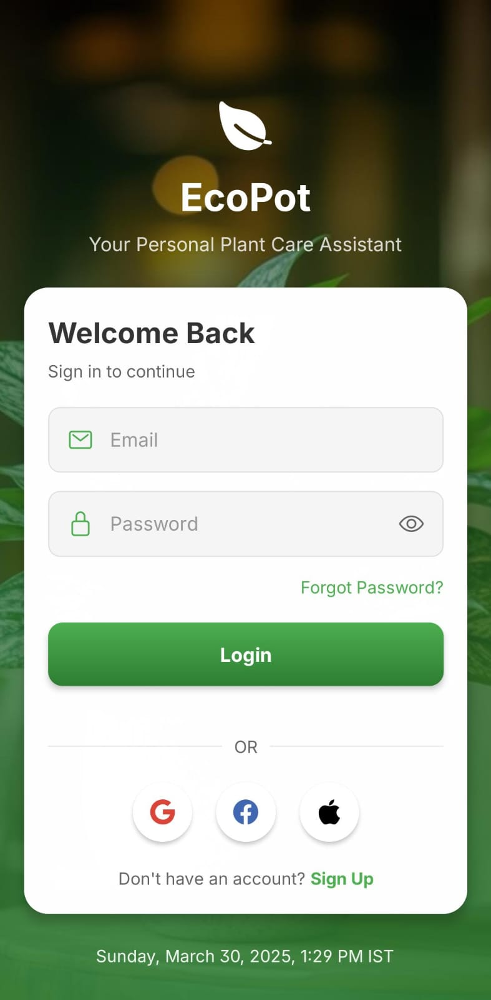
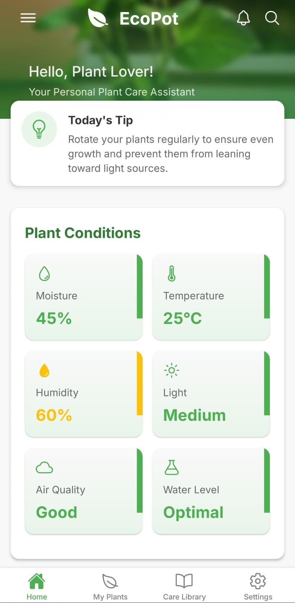
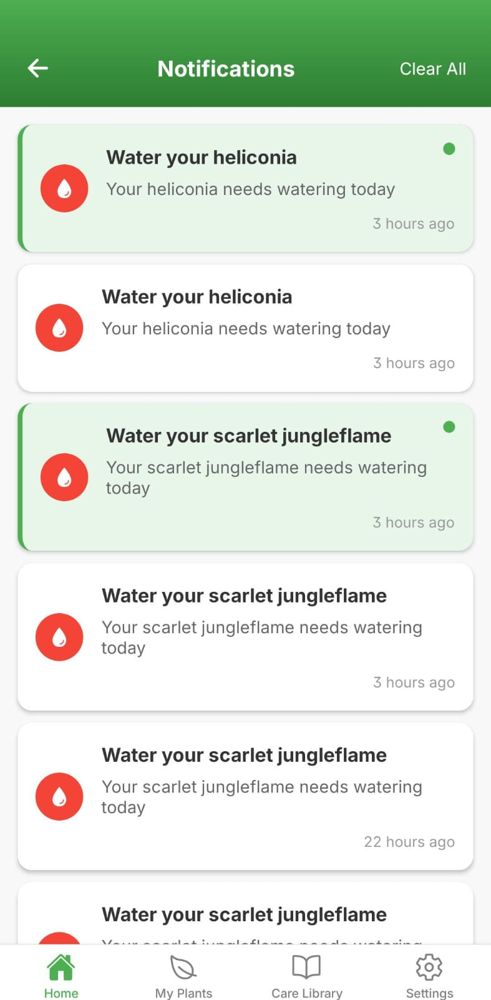
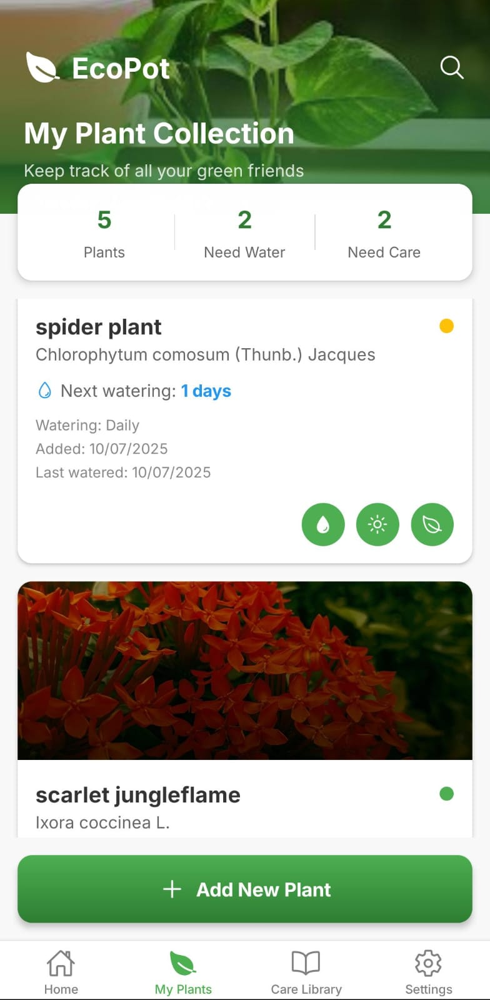
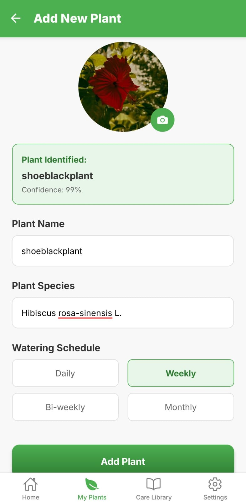
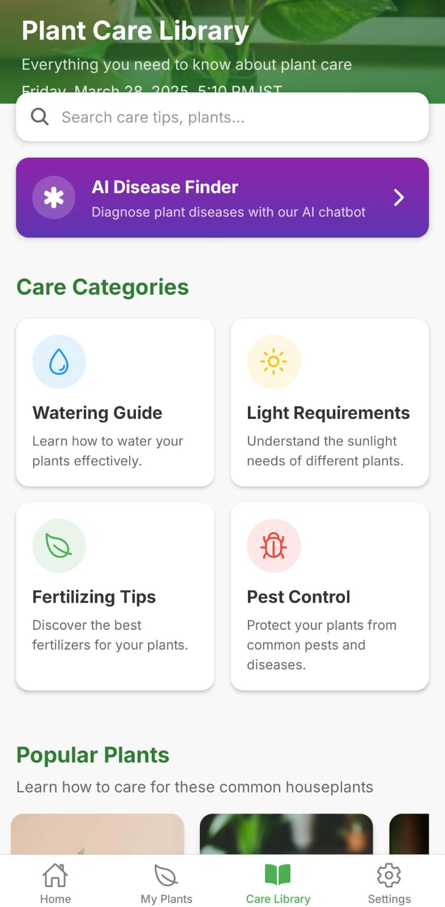
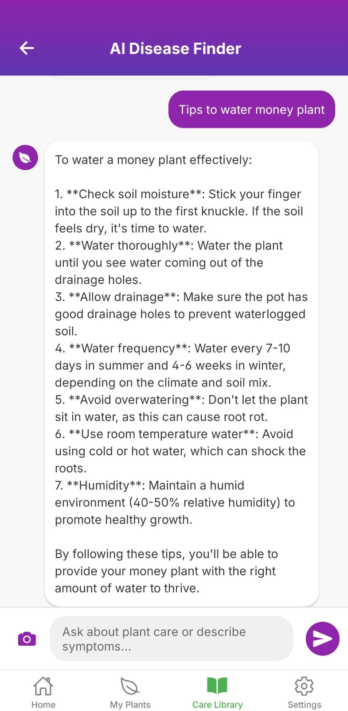
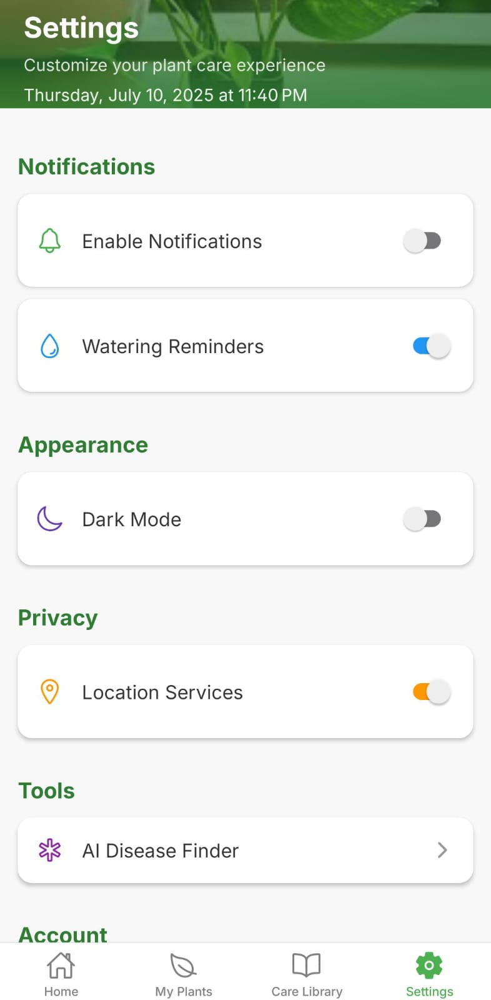

# 🌿 EcoPot — Smart Plant Monitoring & Care App

**EcoPot** is an IoT-powered smart plant pot system that combines embedded sensors, real-time data, Firebase integration, and AI to help you care for your plants like a pro — right from your phone.

It features automated monitoring, AI-based plant recognition and disease diagnosis, and a clean mobile interface built with React Native.

---

## ✨ Features

- 🔐 **Login Page** *(UI ready — authentication coming soon)*
- 🌿 **Home Screen** — Displays live plant vitals from **environmental sensors** using MQTT
- 🔔 **Notifications** — Smart alerts when a plant needs care
- 🌱 **My Plants** — View and manage all your added plants
- ➕ **Add New Plant** — Upload or click a plant image → AI identifies species using **Plant.id API**
- 📚 **Care Library** — Access general tips for maintaining plant health
- 🤖 **AI Disease Finder** — Upload a photo and chat with AI (via **Groq API**) for diagnosis
- 💾 **Cloud Storage** — User and plant data synced in real-time via **Firebase Realtime Database**
- 💧 **Auto Irrigation** — Automatic **water pump** activates when moisture is low
- 📢 **Audio Alerts** — Speaker output for critical care reminders
- 🖥️ **Display Module** — Live vitals shown on a digital screen
- ⚙️ **Settings Page** — Customize app preferences

---

## 🔧 Hardware Setup

### 🛠️ Working prototype 

**Hardware Components:**
- ESP32 microcontroller
- Environmental sensors (moisture, temperature, humidity, etc.)
- Relay-controlled **water pump**
- **Display module** to show plant health stats
- **Speaker** for audio notifications
- Power module and connections

---

## 📲 App Screenshots

### 🔐 Login  

### 🌿 Home Screen  

### 🔔 Notifications  

### 🌱 My Plants  

### ➕ Add New Plant  

### 📚 Care Library  

### 🤖 AI Disease Finder  

### ⚙️ Settings  

---

## ⚙️ Tech Stack

| Layer         | Technology & Tools                           |
|---------------|-----------------------------------------------|
| **Hardware**  | ESP32 + environmental sensors + water pump + display + speaker |
| **Data Comm.**| MQTT for real-time data transfer             |
| **Backend**   | Firebase Realtime Database                   |
| **AI APIs**   | [Plant.id API](https://web.plant.id/), [Groq API](https://groq.com) |
| **Mobile App**| React Native (Expo)                          |
| **Languages** | JavaScript, TypeScript, C++                  |

---

## 👨‍💻 Contributors

Made with 💚 by:

- [@Varun-Arunprabhu](https://github.com/Varun-Arunprabhu)
- [@vignesh2904](https://github.com/vignesh2904)
- [@Vinayakpai3804](https://github.com/Vinayakpai3804)

---

## 📃 License

_EcoPot — Grow Smart. Live Green._ 🌱
